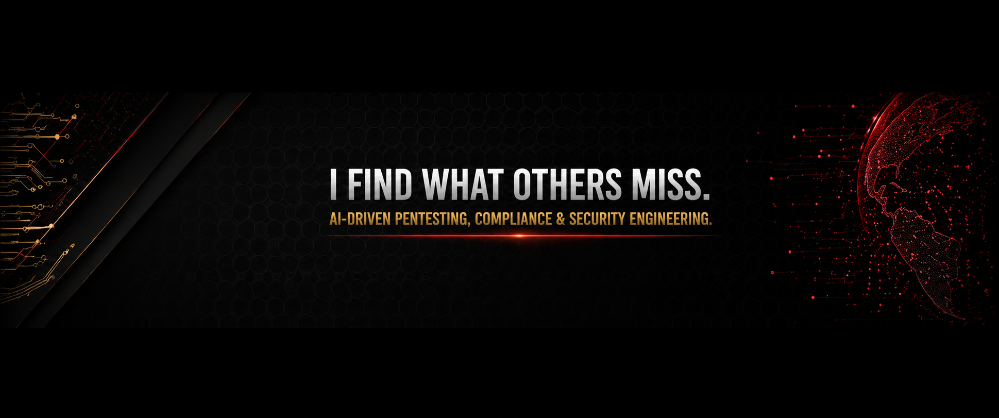
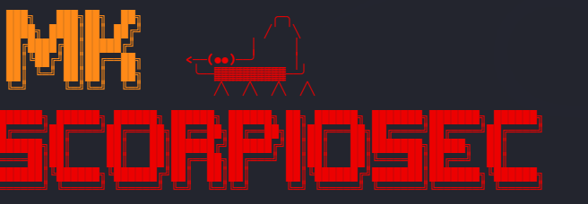

  

 

**AI-Native Security Operations**

*I don't hunt threats. I am the threat.*

---

## About

MK ScorpioSec builds open-source security tooling at the intersection of **AI automation**, **offensive security**, and **regulatory compliance**. Every tool released has been validated on real-world engagements.

I operate a fully air-gapped, AI-native security platform powered by local LLMs, autonomous agents, and orchestration pipelines — no cloud dependency, no data exfiltration risk.

---

## Domains

| Domain | Focus Areas |
|--------|-------------|
| **AI Security** | LLM attack surfaces · MCP server auditing · prompt injection detection · agentic pipeline hardening |
| **Offensive Security** | Automated pentest pipelines · web / mobile / IaC vulnerability research · bug bounty tooling |
| **Post-Quantum & Compliance** | NIST FIPS 203/204/205 readiness · DORA · MiCA · ISO 27001 gap analysis |
| **Cloud & IaC Security** | Terraform misconfiguration research · cloud attack path enumeration · CSPM |
| **Security Automation** | N8N-based SOAR · AI-driven report generation · autonomous vulnerability triage |

---

## Open Source Tools

COMING SOON

---

## Stack

---

## Research Focus

- **Post-Quantum Cryptography** — auditing PKI, TLS, and key exchange against NIST PQC standards before mandatory migration deadlines
- **AI Attack Surface** — testing LLM integrations, MCP servers, and agentic pipelines for injection, exfiltration, and supply-chain vectors
- **IaC Security** — Terraform misconfiguration research, Checkov gap analysis, undocumented findings in community benchmark repos
- **Autonomous Pentesting** — AI-driven recon, vulnerability correlation, and remediation pipelines that close the loop from finding to report

---

## Security Policy

Responsible disclosure via [GitHub Security Advisories](https://github.com/mk-scorpiosec/.github/security/advisories). I respond within 48 hours and follow coordinated disclosure.

---

*Auditing the AI stack so you don't have to.*

